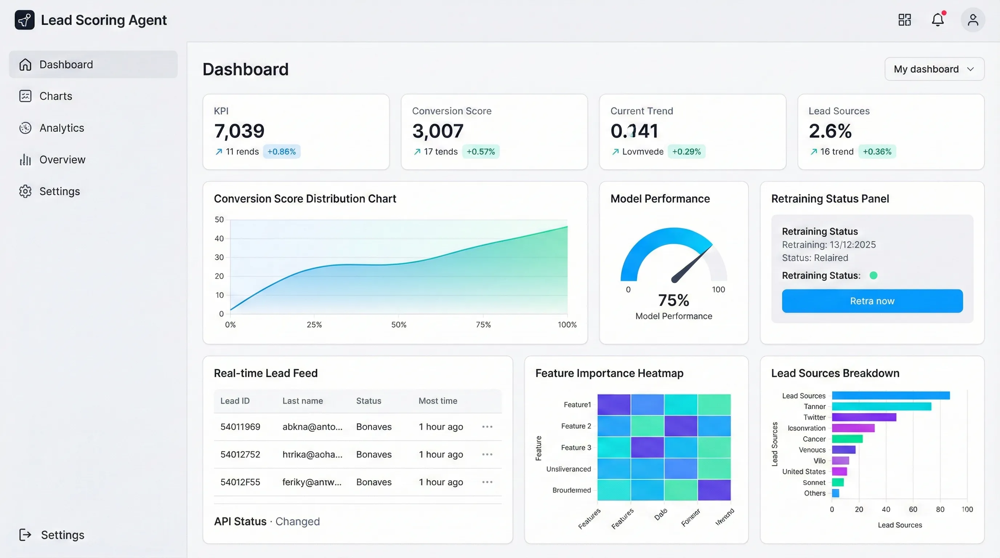
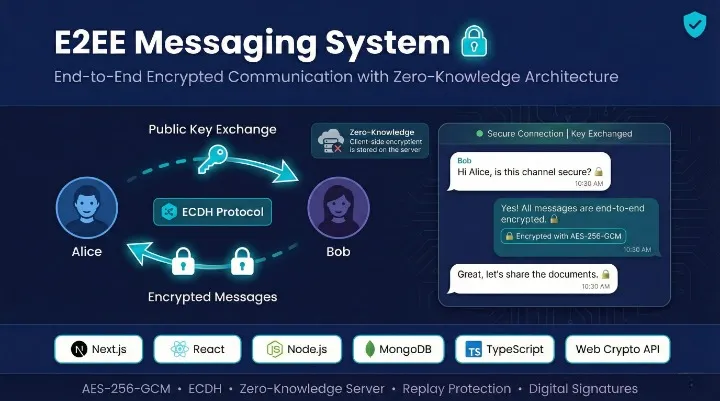
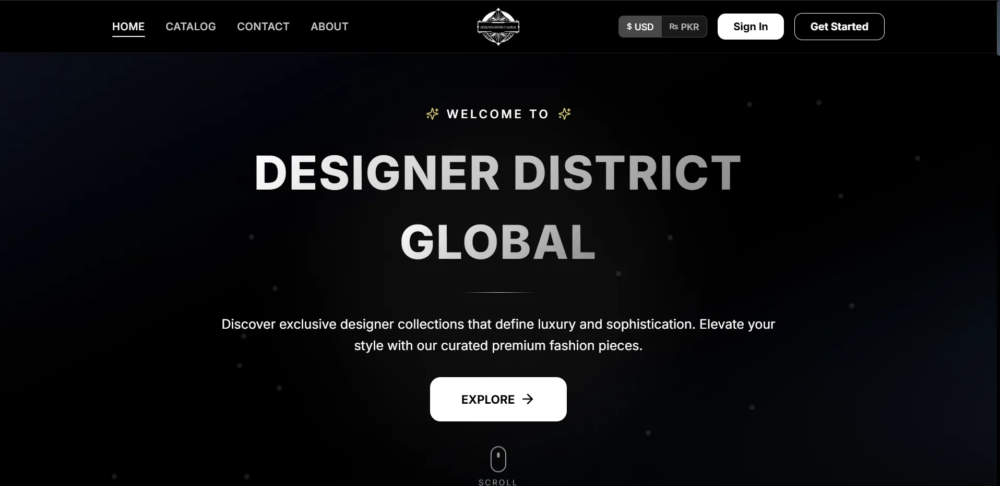
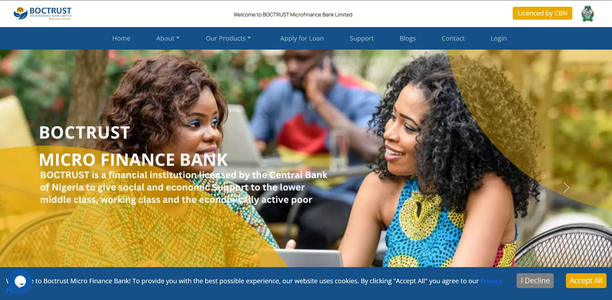
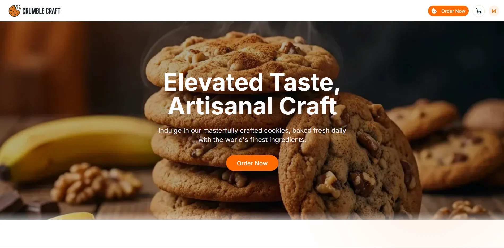
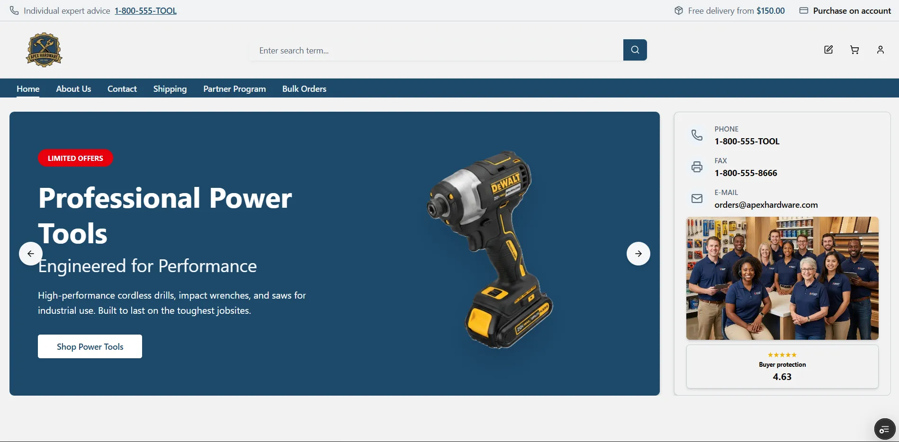
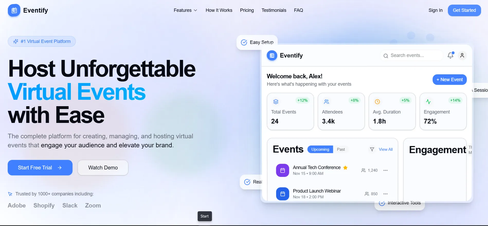

  

  

    
    
    
    
  

---

### About

I build AI automation systems and production-grade web applications. Recent projects include an ML agent with 99.86% prediction accuracy, e-commerce platforms scoring 98+ on Lighthouse, and fintech systems with military-grade encryption.

**B.S. Software Engineering** — FAST NUCES, Islamabad *(Expected 2026)*  
Available for freelance projects on **[Upwork](https://www.upwork.com/freelancers/~01225d147de583774d)** and **[Fiverr](https://www.fiverr.com/s/xXx3owD)**.

---

### Tech Stack

| Domain | Technologies |
|--------|-------------|
| **Core Stack** | React 19, Next.js, TypeScript, Node.js, Python, FastAPI |
| **Data & AI** | MongoDB, PostgreSQL, Supabase, LangChain, Scikit-learn |
| **Infrastructure** | Docker, GitHub Actions, Vercel, AWS, AES-256-GCM |

---

### Featured Projects

<table>
  <tr>
    <td width="50%">
      <h4 align="center">Lead Scoring AI Agent</h4>
      
      
Autonomous AI agent that predicts lead conversion using a 37-feature classification model with real-time dashboard.

      

        Python · FastAPI · Scikit-learn · React · Railway 
        99.86% accuracy · 2.3s response · 50% less time on cold leads
      

      

        <a href="https://github.com/shuja609/lead-scoring-agent">📂 Source</a>
      

    </td>
    <td width="50%">
      <h4 align="center">E2EE Messaging System</h4>
      
      
Zero-knowledge encrypted messaging with ECDH key exchange — the server never sees plaintext.

      

        Next.js 16 · Web Crypto API · Socket.io · MongoDB 
        AES-256-GCM encryption · ECDH key exchange · MITM prevention
      

      

        <a href="https://github.com/shuja609/E2E_Project">📂 Source</a>
      

    </td>
  </tr>
  <tr>
    <td width="50%">
      <h4 align="center">Designer District — Luxury E-Commerce</h4>
      
      
High-end fashion platform with session-aware promotions, automated admin dashboard, and Stripe payments.

      

        Next.js 15 · Stripe · Supabase · Tailwind CSS 4 
        98+ Lighthouse · Session-aware promos · 95% faster campaigns
      

      

        <a href="https://designerdistrictglobal.com/">🔗 Live</a>
      

    </td>
    <td width="50%">
      <h4 align="center">Boctrust Loan App — Enterprise Fintech</h4>
      
      
Secure microfinance platform with AES-256-GCM encryption for PII data and automated security testing.

      

        Node.js · MongoDB · AES-256-GCM · JWT · Jest 
        96+ Lighthouse · 97% faster recovery · 200+ concurrent users
      

      

        <a href="https://boctrustmfb.com/">🔗 Live</a>
      

    </td>
  </tr>
  <tr>
    <td width="50%">
      <h4 align="center">3D Box Calculator — Design Tool</h4>
      
      
Interactive 3D packaging configurator supporting 8+ FEFCO box types with real-time rendering.

      

        Three.js · GSAP · Next.js · Supabase · i18next 
        8+ FEFCO box types · Real-time 3D · Multi-language (EN/NL/DE)
      

      

        <a href="https://www.verpakkingenxl.nl/dozen/doos-op-maat/amerikaanse-vouwdoos-op-maat-fefco-201/">🔗 Live</a>
      

    </td>
    <td width="50%">
      <h4 align="center">Royal Devs — Agency Website</h4>
      
      
Modern agency site with cinematic animations, SEO optimization, and automated CI/CD deployment.

      

        Next.js 15 · React 19 · Framer Motion · Shadcn/UI 
        100% Lighthouse score · 50% faster loads · CI/CD pipeline
      

      

        <a href="https://royal-devs.com/">🔗 Live</a>
      

    </td>
  </tr>
</table>

> *"Shuja delivered a complex fintech platform with military-grade encryption and 97% performance improvement — on time and with zero security incidents."*
> — Ahmed R., Lead Developer, Boctrust MFB

<strong>More Projects</strong>

 
<table>
  <tr>
    <td width="33%" align="center">
      <h4>Crumble Craft</h4>
      
      
E-commerce with multi-step checkout and local payments

      Next.js 15 · MongoDB · NextAuth.js 
      <a href="https://mama-cookies-one.vercel.app/">🔗 Live</a>
    </td>
    <td width="33%" align="center">
      <h4>Hardware Store</h4>
      
      
Equipment storefront with animated product showcases

      Next.js 16 · GSAP · Radix UI 
      <a href="https://hardware-store-inky.vercel.app/">🔗 Live</a>
    </td>
    <td width="33%" align="center">
      <h4>Eventify</h4>
      
      
Event planning platform with scheduling and RSVPs

      React 19 · Vite · Shadcn/UI 
      <a href="https://eventify-jet-one.vercel.app/">🔗 Live</a>
    </td>
  </tr>
</table>

---

### Experience

**Software Developer Intern** — Islamic Manpower Promoters *(Jun 2025 – Aug 2025)*
- Developed and tested backend services using NestJS and Jest, ensuring robust and scalable application logic
- Implemented process automation workflows using n8n and contributed to the development of an ERP system
- Collaborated with the team to integrate new features and resolve bugs in a fast-paced agile environment
- Enhanced code quality through rigorous unit testing and code reviews

**Full Stack Developer Intern** — Craftlab *(Jun 2024 – Aug 2024)*
- Built a client dashboard with React and integrated REST APIs for real-time order tracking
- Developed reusable UI component library and implemented responsive layouts for client-facing products
- Wrote automated tests and helped set up staging deployment pipelines using GitHub Actions

---

### GitHub Activity

  

  

---

  Have a project in mind? Let's talk → <a href="https://www.shuja.me"><strong>shuja.me</strong></a> · <a href="mailto:shujaqurashi2172@gmail.com"><strong>Email</strong></a>

