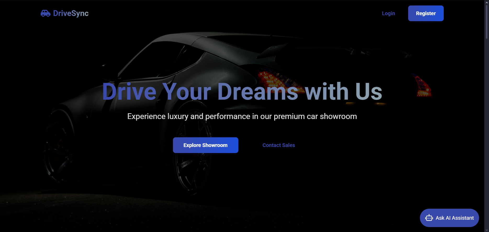
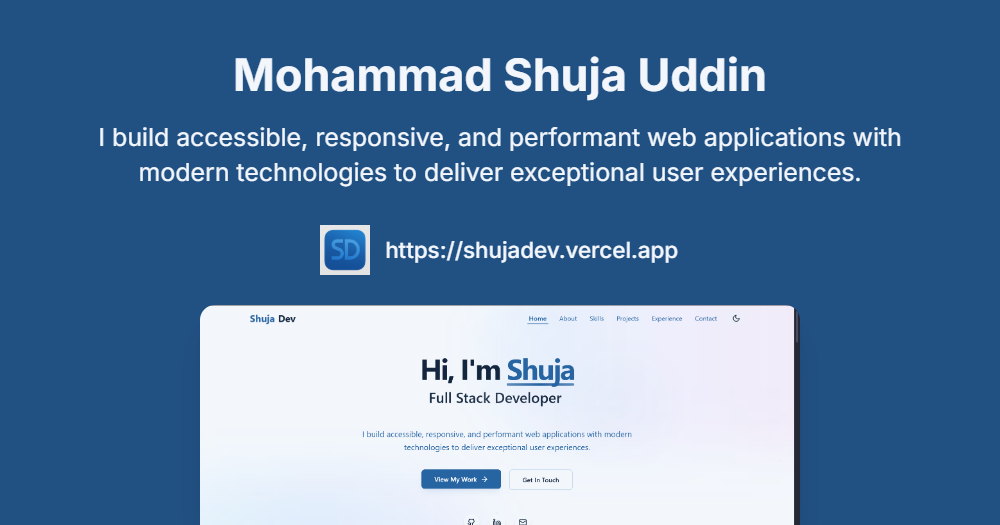

  
  
  

  

    
    
    
  

 

  

<h2 align="center">
  
  About Me
</h2>

  

  > *`Software Engineering student passionate about building high-performance, scalable, and efficient web applications`*

  ### 🎓 Education
  - **Bachelor of Software Engineering** @ FAST National University of Computer & Emerging Sciences, Islamabad *(2022 - 2026)*
    - Focus: Web Development, Data Structures, Software Architecture, Database Systems
  
  - **Cadet College Swat** *(2016 - 2021)*
    - Strong foundation in mathematics and sciences

  ### 🚀 Current Focus
  - MERN Stack Development
  - Backend Architecture with Spring Boot
  - Cloud-based Solutions
  - Advanced Database Systems with MongoDB

 

  

<h2 align="center">
   
  Skills & Technologies
</h2>

  <table style="border: none; background: transparent;">
    <tr>
      <td align="center" width="96">
        
         C++
      </td>
      <td align="center" width="96">
        
         Java
      </td>
      <td align="center" width="96">
        
         JavaScript
      </td>
      <td align="center" width="96">
        
         TypeScript
      </td>
      <td align="center" width="96">
        
         SQL
      </td>
      <td align="center" width="96">
        
         HTML/CSS
      </td>
    </tr>
    <tr>
      <td align="center" width="96">
        
         React
      </td>
      <td align="center" width="96">
        
         Node.js
      </td>
      <td align="center" width="96">
        <a href="#">
          

            
          

        </a>
         Express
      </td>
      <td align="center" width="96">
        
         REST API
      </td>
      <td align="center" width="96">
        
         GraphQL
      </td>
      <td align="center" width="96">
        
         Redux
      </td>
    </tr>
    <tr style="background: rgba(0,0,0,0.1);">
      <td align="center" width="96">
        
         AWS
      </td>
      <td align="center" width="96">
        
         Docker
      </td>
      <td align="center" width="96">
        
         MongoDB
      </td>
      <td align="center" width="96">
        
         Spring Boot
      </td>
      <td align="center" width="96">
        <a href="#">
          

            
          

        </a>
         Next.js
      </td>
      <td align="center" width="96">
        
         Tailwind
      </td>
    </tr>
  </table>

  <h3>
     
    Development Tools & Platforms
  </h3>
  
  

    
    
    
    
    
  

  
  

    
<b>🌟 Click to see more skills</b>

     
    

      
      
      
      
      
      
    

  

  

  

<h2 align="center">
   
  Featured Projects
</h2>

<table>
  <tr>
    <td width="50%">
      <h3 align="center">🚗 DriveSync</h3>
      

        
        

          <strong>Vehicle Management System</strong>
           
          <code>MERN • JWT • Multer • Chart.js</code>
        

        

          
          
        

      

    </td>
    <td width="50%">
      <h3 align="center">👨‍💻 ShujaDev Portfolio</h3>
      

        
        

          <strong>Modern Developer Portfolio</strong>
           
          <code>React • TypeScript • Tailwind • ShadCN</code>
        

        

          
          
        

      

    </td>
  </tr>
  <tr>
    <td colspan="2" align="center">
      <h4>More Projects</h4>
      

        
        
      

    </td>
  </tr>
</table>

  

  

<h2 align="center">
  
  Activity & Statistics
</h2>

  <picture>
    <source 
      srcset="https://github-readme-streak-stats.herokuapp.com/?user=shuja609&theme=dark&hide_border=true&stroke=0000&background=0D1117&ring=00FFB3&fire=00FFB3&currStreakLabel=00FFB3"
      media="(prefers-color-scheme: dark)"
    />
    <source
      srcset="https://github-readme-streak-stats.herokuapp.com/?user=shuja609&theme=default&hide_border=true&stroke=0000&ring=00FFB3&fire=00FFB3&currStreakLabel=00FFB3"
      media="(prefers-color-scheme: light), (prefers-color-scheme: no-preference)"
    />
    
  </picture>

  

    
    
    
  

  
  

     
    
  

  

    
<b>🏆 GitHub Trophies</b>

     
    
  

  

    
<b>📈 Contribution Graph</b>

     
    
  

  <h3>🐍 Watch my contribution graph get eaten by the snake</h3>
  

  

<h2 align="center">
  ✨ Currently Working On
</h2>

  
  
  

<h2 align="center">
  🌐 Connect with Me
</h2>

  
  &nbsp;
  
  &nbsp;
  

 

  

  

